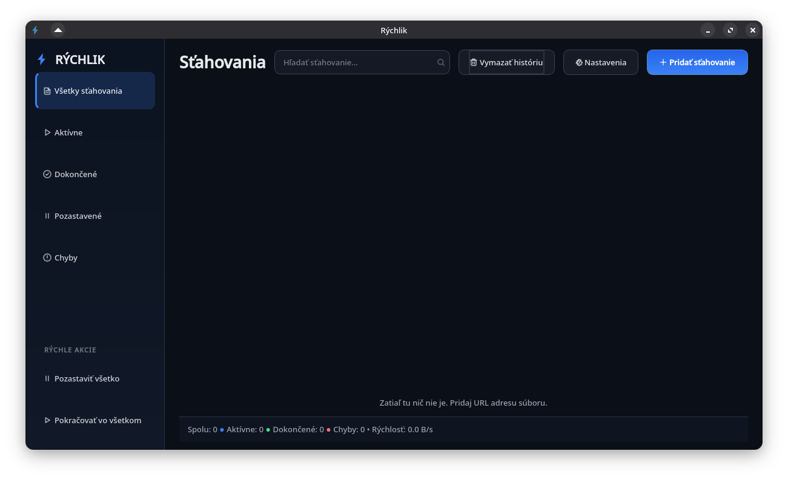

# Rýchlik



Jednoduchý správca sťahovania pre Linux postavený na GTK 4.

## Funkcie

- HTTP/HTTPS sťahovanie so sledovaním priebehu a rýchlosti
- pauza, pokračovanie a obnovenie nedokončeného `.part` súboru
- trvalá história sťahovaní
- bezpečné dokončenie súboru až po úplnom stiahnutí

## Spustenie

```bash
./run.sh
```

Vyžaduje Python 3, GTK 4, PyGObject a balík `requests`. Na distribúciách odvodených od Ubuntu/Debian ich možno nainštalovať cez:

```bash
sudo apt install python3-gi gir1.2-gtk-4.0 python3-requests
```

Poznámka: Obnovenie sťahovania funguje, ak vzdialený server podporuje HTTP Range požiadavky.

## Doplnok do prehliadača

Najprv spusti Rýchlik. Potom načítaj priečinok `browser-extension` ako dočasný/rozbalený doplnok:

- Firefox: otvor `about:debugging` → **This Firefox** → **Load Temporary Add-on** → vyber `manifest.json`.
- Chromium/Chrome: otvor `chrome://extensions` → zapni **Developer mode** → **Load unpacked** → vyber priečinok `browser-extension`.

Po kliknutí pravým tlačidlom na odkaz, video alebo zvuk sa zobrazí voľba **Stiahnuť cez Rýchlik**. Lokálne spojenie používa iba adresu `127.0.0.1:17654`.

Ak stránka obsahuje viditeľné HTML5 video, vpravo hore sa zobrazí modré tlačidlo **Stiahnuť video**. Rýchlik analyzuje stránku pomocou `yt-dlp` a podľa potreby spojí obraz so zvukom cez FFmpeg. DRM chránený obsah sa nesťahuje.

Na prihlásených stránkach doplnok odošle iba adresu práve prehrávaného média. Rýchlik môže počas požiadavky načítať cookies z lokálneho profilu Firefoxu alebo Chromia; cookies ani heslá nekopíruje do svojej histórie. Funguje to iba pre obsah, ktorý je v prehliadači už dostupný. Ak stránka používa DRM alebo médiá nesprístupní ako podporovaný stream, sťahovanie sa odmietne alebo skončí chybou.
